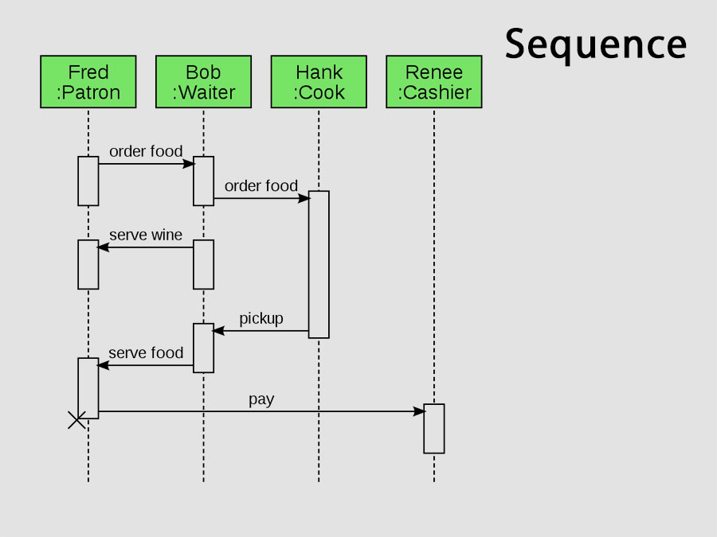
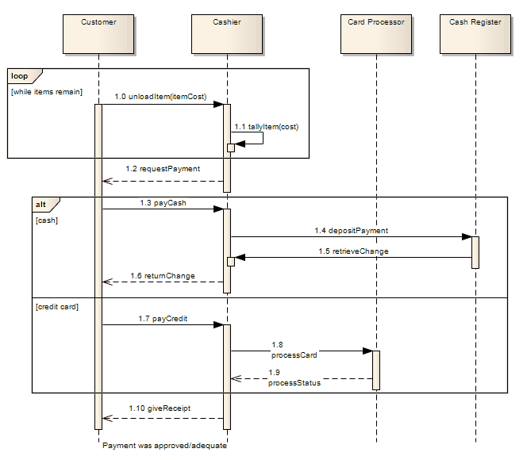

# Sequence

* 🔖 **Définition**
* 🔖 **Syntaxe**
* 🔖 **Fragments**

___

## 📑 Définition

Un diagramme de séquence montre les interactions d'objets organisées en séquence temporelle. Il décrit les objets et les classes impliqués dans le scénario et la séquence de messages échangés entre les objets nécessaires pour exécuter la fonctionnalité du scénario. Les diagrammes de séquence sont généralement associés aux réalisations de cas d'utilisation dans la vue logique du système en cours de développement.

___

## 📑 Syntaxe

### 🏷️ **Actor**

🔗 [Use Case](https://github.com/POEC-20-05/UML/wiki/02) / Syntaxe

### 🏷️ **Lifeline**

Une ligne de vie représente un élément connectable distinct et est un participant individuel à une interaction.

La bonne pratique consiste à montrer comment un élément d'affichage communique avec d'autres objets. Je vous propose de les différencier même si votre logiciel ne les propose pas, nous pouvons nous appuyer sur de la couleur.

* 

Il s'agit de la vue du modèle Model-View-Controller.

* 

Il s'agit du contrôleur du modèle Model-View-Controller.

* 

Il s'agit du modèle du modèle Model-View-Controller.

### 🏷️ **Message**

Un message indique un flux d'informations ou une transition de contrôle entre les éléments. Il indique une intération via l'exéctuion d'une opération de l'élément ciblé.

En principe, seuls les appels de méthode sont affichés dans le diagramme de séquence. Si vous souhaitez néanmoins tracer les retours de méthode, cela peut être fait avec une flèche et une ligne pointillée.

### 🏷️ **Self message**

Un Self-Message reflète un nouveau processus ou une nouvelle méthode invoquée au sein de l'opération de la ligne de vie appelante.

### 🏷️ **Destruction**

Si un objet est détruit lors de l'appel d'une méthode, la ligne de vie de l'objet se termine par une croix sous le symbole d'appel de méthode.

### 🏷️ **Creation**

Si une méthode crée un objet, la flèche de la méthode se termine sur le symbole rectangulaire de l'objet. La ligne de vie commence à ce symbole.

___

👨🏻‍💻 Manipulation

Pour un Use Case, créez un diagramme de séquence. Mettez e place les lignes de vies et utilisez la syntaxe observée pour les relier. Vous devrez penser responsabilité et identifiants des opérations d'interactions pour compléter le diagramme

___

## 📑 Fragments

Des opérations peuvent se répéter ou être sous condition. Les structures modifiant le flux d'instructions sont des fragments combinés.

Les fragments possèdent un opérateur et optionnement une guard.

### 🏷️ **Opérateurs**

Les opérateurs permettent de donner un sens sémantique au fragment.

* alt : fragments multiple alternatifs (if else)
* opt : fragment optionnel (if)
* par : fragment parallèle (traitements concurrents)
* loop : le fragment s'exécute plusieurs fois
* region : région critique (un seul thread à la fois)
* neg : une interaction non valable
* break : représente des scenario d'exception
* ref : référence à une interaction dans un autre diagramme
* sd : fragment du diagramme de séquence en entier

### 🏷️ **Guard**

Une guard est une condition sous laquelle le fragment s'exécute, la notation est entre crochets.

___

👨🏻‍💻 Manipulation

Complétez votre diagramme en utilisant un ou plusieurs fragments.

___